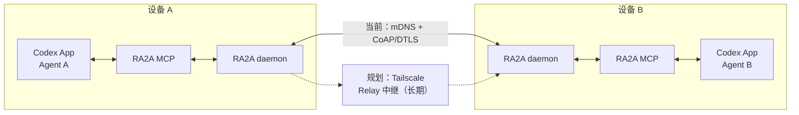

<div align="center">

# RA2A

### 让局域网里的 Codex Agent 彼此找到，并直接协作

RA2A 是一个面向 **Codex App** 的轻量级局域网协作桥梁。

它让不同设备上的 Agent 自动发现彼此，并向指定 Codex session 定向发送消息。

[](https://github.com/ceasarXuu/RA2A/releases/latest)
[](https://github.com/ceasarXuu/RA2A/actions/workflows/release.yml)
[](go.mod)
[](#支持范围)

**无需中心服务 · 无需公网中转 · 单一可执行程序 · 安装后自动保活**

[快速开始](#快速开始) · [Agent 支持](#agent-支持) · [连接路线](#连接路线) · [工作原理](#工作原理)

</div>



## Agent 支持

| 状态 | Agent / Host | 说明 |
|---|---|---|
| **当前支持** | Codex App | 已完成 macOS 与 Windows 跨设备真实验收 |
| **计划支持** | Claude Code | 通过对应会话接口接入 RA2A 网络 |
| **计划支持** | Claude Desktop App | 面向桌面会话的定向消息投递 |
| **计划支持** | OpenCode | 复用 RA2A 的发现与消息协议 |
| **计划支持** | Pi | 复用 RA2A 的发现与消息协议 |
| **计划支持** | DeepSeek Harness | 复用 RA2A 的发现与消息协议 |

当前可用版本只面向 **Codex App**；计划项表示产品方向，不代表已经实现或承诺具体交付时间。

## 连接路线

| 阶段 | 连接方式 | 用途 |
|---|---|---|
| **当前支持** | 局域网直连 | mDNS 自动发现，CoAP/DTLS 传输消息 |
| **计划支持** | Tailscale | 连接不在同一物理局域网、但属于同一 Tailscale 私有网络的设备 |
| **长期计划** | Relay 中继 | 为无法直连的设备提供跨网络发现与消息转发 |

## 为什么是 RA2A

多设备联调时，任务、日志和会话往往分散在不同机器上。RA2A 让 Agent 直接发现目标设备，并把消息送进指定 session：

- **定向**：消息准确进入目标 session。
- **连续**：不抢占 Desktop writer，注入后仍可继续原会话。
- **自愈**：网络波动后自动重新发现和恢复连接。

## 典型场景

1. **多设备联调**：Mac 上开发、Windows 上复现，或 Linux 设备提供运行环境。Agent 可以把构建、复现、日志采集和验证请求直接发送到对应设备的专用 session，再把结果回传，无需人工复制上下文。
2. **跨设备 Agent 分工**：让 Mac 上负责规划的 Agent，把实现任务交给 Windows 工作站上的 Agent；完成后，Windows Agent 再将结果回复到来源 session。

## 快速开始

不需要 Git、Go、源码目录或管理员权限。目标设备需要已安装 Codex App。

### macOS / Linux

```bash
curl -fsSL https://github.com/ceasarXuu/RA2A/releases/latest/download/install-ra2a.sh | sh
export PATH="$HOME/.local/bin:$PATH"
ra2a
```

### Windows PowerShell

```powershell
irm https://github.com/ceasarXuu/RA2A/releases/latest/download/install-ra2a.ps1 | iex
$env:Path = "$env:LOCALAPPDATA\RA2A\bin;$env:Path"
ra2a
```

首次运行时：

1. 为设备设置一个容易识别的名称。
2. RA2A 自动生成并显示长期 6 位 PIN。
3. 在其他设备安装 RA2A，执行 `ra2a pin <PIN>` 加入同一组。

看到 `status: running` 后，引导会自动退出，服务转入后台运行，不会继续占用终端。Codex 会自动获得 RA2A MCP 工具。

> 当前 PIN 是用于最小可信握手的共享凭证，不是面向恶意网络环境的完整认证系统。请只在可信局域网中使用 RA2A。

## Agent 工具

安装后，Codex 自动获得两个正式工具：

### `list_targets()`

列出局域网内已发现的 RA2A 节点，以及各节点未归档 session 的 ID、标题和状态。

- 节点状态：`ready`、`degraded` 或 `unreachable`
- 网络暂时波动时保留最近一次成功结果，并标记 `sessionsStale=true`
- Agent 可以直接取得下一步 `send_message` 所需的目标地址

### `send_message(to, text)`

向 `ra2a://<node-id>/<session-id>` 创建远端 Codex 回合。RA2A 自动附带来源 session 地址和唯一 message ID，因此远端 Agent 可以定向回复。

```text
Mac / Planner
    └─ send_message("ra2a://windows-dev/<session-id>", "请验证 Windows 构建")
          └─ Windows / Builder 接收并执行
                └─ 回复来源 session
```

`accepted` 表示远端已经创建回合，不表示 Agent 已完成任务。忙碌、不可达和投递结果未知分别返回 `SESSION_BUSY`、`TARGET_UNREACHABLE` 和 `DELIVERY_UNKNOWN`；RA2A 不会在结果未知时自动重发，从而避免重复创建任务。

## 工作原理

如顶部原理图所示，RA2A 采用单宿主模型。安装器把同一个二进制注册为 Codex stdio MCP；每次工具调用通过 loopback 访问常驻 daemon，不会重复启动 LAN 节点或 App Server。

核心路径：

1. mDNS 在局域网广播和发现 RA2A 节点。
2. CoAP/DTLS 使用相同 6 位 PIN 完成握手和消息传输。
3. daemon 通过 Codex App Server 枚举 session 并创建 turn。
4. 目标 thread 已有 Desktop active writer 时，RA2A 窄回退到 Codex Desktop IPC，由现有 owner 创建 turn，不抢占会话。

macOS 与 Windows Codex Desktop 均已完成真实跨设备验收：消息可以进入指定 session，创建并完成 turn，随后用户仍能在原 session 手动继续沟通。

## 支持范围

| 项目 | 当前支持 |
|---|---|
| Host | Codex App |
| 平台 | macOS、Linux、Windows |
| 架构 | amd64、arm64 |
| 通信范围 | 同一可信局域网 |
| 节点发现 | mDNS / `_ra2a._udp.local` |
| 消息传输 | CoAP over DTLS-PSK |
| 后台保活 | macOS LaunchAgent、Linux systemd user、Windows 计划任务 |

当前版本仅正式支持 Codex App；其他 Agent / Host 与跨网络连接方式见前文路线。当前不包含离线消息、持久队列和工作流编排。

## 日常命令

| 命令 | 行为 |
|---|---|
| `ra2a` | 首次运行进入引导；后续确认服务正在运行并退出 |
| `ra2a restart` | 重启后台服务 |
| `ra2a name [名称]` | 设置设备名称；省略参数时交互输入 |
| `ra2a pin [6位PIN]` | 设置长期共享 PIN；省略参数时交互输入 |
| `ra2a version` | 输出当前版本 |
| `ra2a update` | 下载最新正式 Release，校验 SHA-256，更新并重启 |

正常升级只需：

```bash
ra2a update
```

名称、PIN 和节点 ID 在升级时保持不变。

## 安装与服务管理

正式安装程序会从 GitHub latest Release 下载对应系统和架构的预编译文件，并在覆盖现有二进制前校验 SHA-256。

### 无交互安装

macOS / Linux：

```bash
curl -fsSL https://github.com/ceasarXuu/RA2A/releases/latest/download/install-ra2a.sh \
  | sh -s -- \
  --pin A2B3C4 \
  --node-id device-b \
  --name "Device B" \
  --codex /Applications/ChatGPT.app/Contents/Resources/codex
```

Windows PowerShell：

```powershell
$Installer = [scriptblock]::Create((irm https://github.com/ceasarXuu/RA2A/releases/latest/download/install-ra2a.ps1))
& $Installer -Pin A2B3C4 -NodeId device-b -Name "Device B" -Codex C:\absolute\path\to\codex.exe
```

如果 `codex` 不在 `PATH`，首次引导会自动检查 macOS Codex App 内置路径；无交互安装应通过 `--codex` 明确指定。

### 服务状态与日志

| 平台 | 用户级保活机制 | 状态检查 |
|---|---|---|
| macOS | LaunchAgent `com.ra2a.daemon` | `launchctl print gui/$(id -u)/com.ra2a.daemon` |
| Linux | systemd user unit `ra2a.service` | `systemctl --user status ra2a.service` |
| Windows | 当前用户计划任务 `RA2A` | `Get-ScheduledTask -TaskName RA2A` |

macOS 日志位于 `~/.config/ra2a/logs/`；Linux 可使用 `journalctl --user -u ra2a.service`。安装失败时，先确认下载工具、Codex 路径和对应用户级服务管理器可用，再原样重跑安装命令。校验或下载失败不会覆盖已有二进制。

## 设计边界

- RA2A 优先连接官方 canonical control socket；若宿主尚未运行，则启动并监管 `codex app-server`。
- Desktop IPC 是为避免 active-writer 冲突而使用的窄回退路径，该接口没有 OpenAI 的兼容承诺。
- 建连失败保持 `SESSION_BUSY`；写出后超时返回 `DELIVERY_UNKNOWN`。两者都不会触发自动重试或会话抢占。
- 第一版将 6 位 PIN 原样作为 DTLS-PSK，不包含 KDF、证书、PAKE、轮换或锁定，不承诺抵抗猜测、窃取或恶意局域网攻击。
- RA2A 只处理文本消息和 session 定向投递，不试图成为通用 Agent 编排平台。

更完整的设计和验证记录：

- [RA2A 局域网 Agent 通信：极简闭环](prd/2026-08-31-ra2a-minimal-model.md)
- [Codex App 最小可行性实验](experiments/README.md)
- [局域网发现与凭证握手实验](experiments/network/README.md)

## 本地开发

需要 Go 1.24 或更高版本。

```bash
git clone https://github.com/ceasarXuu/RA2A.git
cd RA2A
go test ./...
```

运行完整本机自检：

```bash
go run ./cmd/ra2a selftest --pin A2B3C4 --id local-dev --name "Local Dev"
```

成功输出示例：

```text
discovered=ra2a://local-dev endpoint=127.0.0.1:<port>
sessions=<本机未归档 thread 数>
selftest=ok
```

启动前台开发服务：

```bash
go run ./cmd/ra2a serve --pin A2B3C4 --id local-dev --name "Local Dev"
```

直接检查 MCP 协议（daemon 运行时）：

```bash
printf '%s\n' \
  '{"jsonrpc":"2.0","id":1,"method":"tools/list","params":{}}' \
  | go run ./cmd/ra2a mcp
```

默认从 `PATH` 启动 `codex app-server`。也可以通过 `--codex` 显式指定 Codex App 内置版本。默认 control socket 为 `$CODEX_HOME/app-server-control/app-server-control.sock`；未设置 `CODEX_HOME` 时使用 `~/.codex/app-server-control/app-server-control.sock`，也可以通过 `--app-server-socket` 覆盖。

源码安装和卸载：

```bash
./install.sh
./install.sh --uninstall
```

```powershell
powershell -ExecutionPolicy Bypass -File .\install.ps1
powershell -ExecutionPolicy Bypass -File .\install.ps1 -Uninstall
```

## 发布

GitHub Release 是正式发版主流程。推送 `v*` tag 后，[Release 工作流](.github/workflows/release.yml) 会校验 tag 与程序版本，运行测试和 vet，构建 macOS、Linux、Windows 的 amd64/arm64 产物，并发布逐文件 SHA-256 校验。

维护者应为每个版本创建新的 annotated tag，不得移动或重复使用已经发布的 tag。`ra2a update` 只消费 GitHub 的 latest 正式 Release，不使用草稿或预发布版本。
