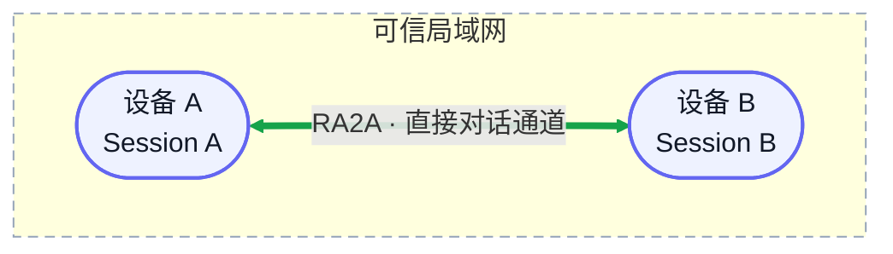

<div align="center">

# RA2A

### 让多台设备上的 Agent 彼此发现，并向指定 session 直接发送消息

[](https://github.com/ceasarXuu/RA2A/releases/latest)
[](https://github.com/ceasarXuu/RA2A/actions/workflows/release.yml)
[](go.mod)
[](#支持路线)

**局域网直连 · 无需中心服务 · 单一可执行程序 · 自动保活与恢复**

[快速开始](#快速开始) · [支持路线](#支持路线) · [典型场景](#典型场景) · [Agent 工具](#agent-工具)

</div>



## 支持路线

### Agent / App

| Agent / App | 状态 | 说明 |
|---|---|---|
| **Codex App** | ✅ 当前支持 | macOS 与 Windows 跨设备真实验收通过 |
| Codex CLI | 🧭 计划支持 | 接入 CLI session |
| Claude Code | 🧭 计划支持 | 接入对应会话接口 |
| Claude Desktop App | 🧭 计划支持 | 支持桌面会话定向投递 |
| OpenCode | 🧭 计划支持 | 接入 RA2A 发现与消息协议 |
| Pi | 🧭 计划支持 | 接入 RA2A 发现与消息协议 |
| DeepSeek Harness | 🧭 计划支持 | 接入 RA2A 发现与消息协议 |

### 平台

| 平台 | 状态 | 架构 | 后台保活 |
|---|---|---|---|
| **macOS** | ✅ 当前支持 | amd64、arm64 | LaunchAgent |
| **Linux** | ✅ 当前支持 | amd64、arm64 | systemd user |
| **Windows** | ✅ 当前支持 | amd64、arm64 | 计划任务 |

**网络路线：** ✅ 局域网直连（当前） → 🧭 Tailscale（计划） → 🔭 Relay 中继（长期）

## 典型场景

1. **多设备联调**：Mac 上开发、Windows 上复现，或 Linux 设备提供运行环境。Agent 直接发送构建、复现、日志采集和验证任务，无需人工复制上下文。
2. **跨设备 Agent 分工**：一台设备上的 Agent 负责规划，另一台负责实现或验证，结果再定向回复到来源 session。

## 快速开始

无需 Git、Go、源码目录或管理员权限。目标设备需要已安装 Codex App。

### macOS / Linux

```bash
curl -fsSL https://github.com/ceasarXuu/RA2A/releases/latest/download/install-ra2a.sh | sh
export PATH="$HOME/.local/bin:$PATH"
ra2a
```

### Windows PowerShell

```powershell
irm https://github.com/ceasarXuu/RA2A/releases/latest/download/install-ra2a.ps1 | iex
$env:Path = "$env:LOCALAPPDATA\RA2A\bin;$env:Path"
ra2a
```

首次运行：设置设备名称 → 保存自动生成的 6 位 PIN → 在其他设备执行 `ra2a pin <PIN>`。看到 `status: running` 后服务已转入后台，Codex 会自动获得 RA2A MCP 工具。

> [!IMPORTANT]
> 当前 PIN 只用于可信局域网内的最小握手，不是完整安全认证系统。

## Agent 工具

| 工具 | 作用 |
|---|---|
| `list_targets()` | 列出已发现节点，以及未归档 session 的 ID、标题和状态 |
| `send_message(to, text)` | 向 `ra2a://<node-id>/<session-id>` 创建远端 Codex 回合 |

RA2A 自动附带来源 session 和唯一 message ID，远端 Agent 可以定向回复。`accepted` 只表示远端已创建回合；忙碌、不可达和投递状态未知分别返回 `SESSION_BUSY`、`TARGET_UNREACHABLE` 和 `DELIVERY_UNKNOWN`。

```text
Mac / Planner
  └─ send_message("ra2a://windows-dev/<session-id>", "请验证 Windows 构建")
       └─ Windows / Builder 执行并回复来源 session
```

## 日常命令

| 命令 | 行为 |
|---|---|
| `ra2a` | 首次引导；后续确认服务正在运行 |
| `ra2a restart` | 重启后台服务 |
| `ra2a name [名称]` | 设置设备名称 |
| `ra2a pin [6位PIN]` | 设置共享 PIN |
| `ra2a version` | 查看版本 |
| `ra2a update` | 校验并更新到最新正式 Release |

## 工作原理与边界

RA2A 将同一个二进制注册为 Codex stdio MCP，并通过 loopback 访问常驻 daemon。daemon 使用 mDNS 发现节点、CoAP/DTLS 传输消息，通过 Codex App Server 枚举 session 和创建 turn。

目标 thread 已由 Desktop 持有时，RA2A 交给现有 Desktop owner 创建 turn，不抢占 writer。macOS 与 Windows 均已完成真实跨设备验收，注入后仍可在原 session 手动继续沟通。

- 当前正式支持 Codex App，不包含离线消息、持久队列和工作流编排。
- Desktop IPC 没有 OpenAI 兼容承诺；失败或投递状态未知时不会自动重试。
- 6 位 PIN 直接作为 DTLS-PSK，不抵抗猜测、窃取或恶意局域网攻击。

<details>
<summary><strong>高级安装与服务管理</strong></summary>

### 无交互安装

macOS / Linux：

```bash
curl -fsSL https://github.com/ceasarXuu/RA2A/releases/latest/download/install-ra2a.sh \
  | sh -s -- --pin A2B3C4 --node-id device-b --name "Device B" \
  --codex /Applications/ChatGPT.app/Contents/Resources/codex
```

Windows PowerShell：

```powershell
$Installer = [scriptblock]::Create((irm https://github.com/ceasarXuu/RA2A/releases/latest/download/install-ra2a.ps1))
& $Installer -Pin A2B3C4 -NodeId device-b -Name "Device B" -Codex C:\absolute\path\to\codex.exe
```

### 服务状态

| 平台 | 保活机制 | 状态检查 |
|---|---|---|
| macOS | LaunchAgent | `launchctl print gui/$(id -u)/com.ra2a.daemon` |
| Linux | systemd user | `systemctl --user status ra2a.service` |
| Windows | 计划任务 | `Get-ScheduledTask -TaskName RA2A` |

macOS 日志位于 `~/.config/ra2a/logs/`；Linux 使用 `journalctl --user -u ra2a.service`。

</details>

<details>
<summary><strong>本地开发与发布</strong></summary>

需要 Go 1.24+：

```bash
git clone https://github.com/ceasarXuu/RA2A.git
cd RA2A
go test ./...
go run ./cmd/ra2a selftest --pin A2B3C4 --id local-dev --name "Local Dev"
```

源码安装：`./install.sh`；卸载：`./install.sh --uninstall`。Windows 对应 `install.ps1` 及其 `-Uninstall` 参数。

GitHub Release 是正式发版流程。推送 `v*` tag 后，[Release 工作流](.github/workflows/release.yml) 会校验版本、测试、构建六个平台产物并发布 SHA-256。

</details>

## 设计与验证记录

- [极简闭环设计](prd/2026-08-31-ra2a-minimal-model.md)
- [Codex App 可行性实验](experiments/README.md)
- [局域网发现与握手实验](experiments/network/README.md)
