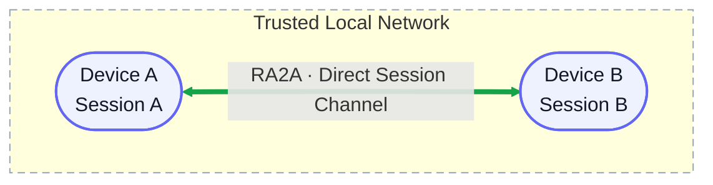

<div align="center">

**English** | [简体中文](README.zh-CN.md)

# RA2A

### A direct session-to-session messaging channel for agents across devices

[](https://github.com/ceasarXuu/RA2A/releases/latest)
[](https://github.com/ceasarXuu/RA2A/actions/workflows/release.yml)
[](go.mod)
[](#support-roadmap)

**LAN-native · No central server · Single binary · Automatic supervision and recovery**

[Quick Start](#quick-start) · [Support Roadmap](#support-roadmap) · [Use Cases](#use-cases) · [Agent Tools](#agent-tools)

</div>



## Support Roadmap

### Agent / App

| Agent / App | Status | Notes |
|---|---|---|
| **Codex App** | ✅ Supported | Cross-device validation completed on macOS and Windows |
| Codex CLI | 🧭 Planned | Connect CLI sessions |
| Claude Code | 🧭 Planned | Connect through its session interface |
| Claude Desktop App | 🧭 Planned | Deliver messages to specific desktop sessions |
| OpenCode | 🧭 Planned | Integrate with RA2A discovery and messaging |
| Pi | 🧭 Planned | Integrate with RA2A discovery and messaging |
| DeepSeek Harness | 🧭 Planned | Integrate with RA2A discovery and messaging |

### Platforms

| Platform | Status | Architectures | Background supervision |
|---|---|---|---|
| **macOS** | ✅ Supported | amd64, arm64 | LaunchAgent |
| **Linux** | ✅ Supported | amd64, arm64 | systemd user service |
| **Windows** | ✅ Supported | amd64, arm64 | Scheduled Task |

**Network roadmap:** ✅ LAN direct connection (current) → 🧭 Tailscale (planned) → 🔭 Relay (long term)

## Use Cases

1. **Multi-device debugging:** Develop on macOS, reproduce on Windows, or run workloads on Linux. Agents can send build, reproduction, log collection, and validation tasks directly to the right session without manually copying context.
2. **Cross-device agent collaboration:** One agent plans while another implements or validates on a different machine, then sends the result back to the originating session.

## Quick Start

No Git, Go, source checkout, root, or administrator privileges required. The target device must have Codex App installed.

### macOS / Linux

```bash
curl -fsSL https://github.com/ceasarXuu/RA2A/releases/latest/download/install-ra2a.sh | sh
export PATH="$HOME/.local/bin:$PATH"
ra2a
```

### Windows PowerShell

```powershell
irm https://github.com/ceasarXuu/RA2A/releases/latest/download/install-ra2a.ps1 | iex
$env:Path = "$env:LOCALAPPDATA\RA2A\bin;$env:Path"
ra2a
```

On first run: name the device → save the generated six-character PIN → run `ra2a pin <PIN>` on the other devices. Once you see `status: running`, RA2A is running in the background and Codex has access to its MCP tools.

> [!IMPORTANT]
> The current PIN is only a minimal handshake credential for trusted local networks. It is not a complete authentication system.

## Agent Tools

| Tool | Purpose |
|---|---|
| `list_targets()` | List discovered nodes and the IDs, titles, and states of their unarchived sessions |
| `send_message(to, text)` | Start a remote Codex turn at `ra2a://<node-id>/<session-id>` |

RA2A includes the source session and a unique message ID so the remote agent can reply directly. `accepted` only means the remote turn was created. Busy, unreachable, and uncertain-delivery outcomes return `SESSION_BUSY`, `TARGET_UNREACHABLE`, and `DELIVERY_UNKNOWN` respectively.

```text
Mac / Planner
  └─ send_message("ra2a://windows-dev/<session-id>", "Validate the Windows build")
       └─ Windows / Builder runs the task and replies to the source session
```

## Everyday Commands

| Command | Action |
|---|---|
| `ra2a` | Run first-time setup; later, confirm the service is running |
| `ra2a restart` | Restart the background service |
| `ra2a name [name]` | Set the device name |
| `ra2a pin [6-character PIN]` | Set the shared PIN |
| `ra2a version` | Show the installed version |
| `ra2a update` | Verify and update to the latest stable release |

## How It Works and Current Boundaries

RA2A registers the same binary as a Codex stdio MCP server and forwards tool calls over loopback to a resident daemon. The daemon discovers peers with mDNS, transports messages with CoAP/DTLS, and uses Codex App Server to enumerate sessions and start turns.

Peer discovery is lifecycle-aware: goodbye or expired mDNS records remove stale endpoints, and the daemon periodically reloads network interfaces after Wi-Fi changes or system wake. If DTLS fails before delivery, RA2A refreshes discovery and safely retries once against the recovered endpoint, including when a node returns on the same address.

When Codex Desktop already owns the target thread, RA2A asks that existing Desktop owner to start the turn instead of competing for the writer. This flow has been validated across macOS and Windows, and the original session remains usable after message injection.

- Codex App is the only supported host today. Offline delivery, persistent queues, and workflow orchestration are out of scope.
- Desktop IPC has no OpenAI compatibility guarantee. RA2A does not retry after a failed or uncertain delivery.
- The six-character PIN is used directly as the DTLS-PSK. It does not protect against guessing, credential theft, or a hostile local network.

<details>
<summary><strong>Advanced installation and service management</strong></summary>

### Non-interactive installation

macOS / Linux:

```bash
curl -fsSL https://github.com/ceasarXuu/RA2A/releases/latest/download/install-ra2a.sh \
  | sh -s -- --pin A2B3C4 --node-id device-b --name "Device B" \
  --codex /Applications/ChatGPT.app/Contents/Resources/codex
```

Windows PowerShell:

```powershell
$Installer = [scriptblock]::Create((irm https://github.com/ceasarXuu/RA2A/releases/latest/download/install-ra2a.ps1))
& $Installer -Pin A2B3C4 -NodeId device-b -Name "Device B" -Codex C:\absolute\path\to\codex.exe
```

### Service status

| Platform | Supervisor | Status command |
|---|---|---|
| macOS | LaunchAgent | `launchctl print gui/$(id -u)/com.ra2a.daemon` |
| Linux | systemd user | `systemctl --user status ra2a.service` |
| Windows | Scheduled Task | `Get-ScheduledTask -TaskName RA2A` |

macOS logs are stored in `~/.config/ra2a/logs/`. On Linux, use `journalctl --user -u ra2a.service`.

</details>

<details>
<summary><strong>Local development and releases</strong></summary>

Go 1.24+ is required:

```bash
git clone https://github.com/ceasarXuu/RA2A.git
cd RA2A
go test ./...
go run ./cmd/ra2a selftest --pin A2B3C4 --id local-dev --name "Local Dev"
```

Install from source with `./install.sh`; uninstall with `./install.sh --uninstall`. On Windows, use `install.ps1` and its `-Uninstall` option.

GitHub Release is the official release path. Pushing a `v*` tag triggers the [Release workflow](.github/workflows/release.yml), which verifies the version, runs tests, builds six OS/architecture targets, and publishes SHA-256 checksums.

</details>

## Design and Validation Records

- [Minimal closed-loop design](prd/2026-08-31-ra2a-minimal-model.md) (Chinese)
- [Codex App feasibility experiments](experiments/README.md) (Chinese)
- [LAN discovery and handshake experiments](experiments/network/README.md) (Chinese)
