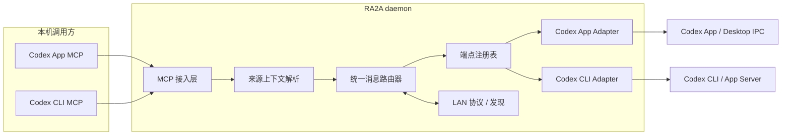

# RA2A v0.0.15 工程实施计划

- 状态：ready-for-execution
- 计划日期：2026-09-02
- 最近修订：2026-09-06（依据 Codex Desktop 开发沉淀重审 Phase 0/Phase 3，见 §5 进度）
- Product Authority Source：[prd.md](./prd.md)
- Applicable Decisions：PD25、PD26、PD27、PD28、PD29、PD30、PD31、PD32

## 1. 目标

在保持现有 Codex App 能力的前提下，引入 Codex CLI，并建立“统一端点 + 统一消息 + Agent 适配器”的内部架构。路由复杂度应随 Agent 类型数量线性增长，而不是形成 N×N 的成对集成。

## 2. 当前实现基线

当前代码已经存在部分可复用边界，但数据模型和运行时仍是单宿主：

- `cmd/ra2a/main.go` 中存在 `sessionSource` 接口，但 daemon 只启动一个 Codex session source，并在其中混合 App Server 与 Desktop IPC 路由。
- `internal/operator/operator.go` 只有单一 `Codex` 可执行文件配置。
- `internal/lannode/node.go` 的 `Session` 没有 Agent 类型、能力和适配器身份。
- `internal/control/control.go` 默认目标地址为 `ra2a://node/session`，来源也只携带 session ID。
- `internal/mcpserver/server.go` 的工具描述和调用上下文均绑定 Codex session，并依赖 `_meta.threadId`。
- `internal/codexhost/host.go` 直接管理 Codex App Server。

v0.0.10-v0.0.14 的 Desktop 开发已把 `internal/codexhost` 打磨为三平台 native 验证过的共享托管基座：单 owner、每次启动独立 socket、PID/socket owner lease、daemon 首次探测与主动监督恢复已退出的受管 App Server、Linux 进程组收割与崩溃安全清理时序、stop/exit 明确控制生命周期。CLI 路线（单 App Server + remote TUI）直接消费该基座，Phase 3 不重复设计或验证 managed host 生命周期。

结论：不能把 Codex CLI 作为现有 source 内的额外条件分支。应先把已有 Codex App 行为收口为适配器，再增加 CLI 适配器。

## 3. 目标架构



核心规则：

1. MCP 与 LAN 层只处理统一端点和统一消息，不调用宿主原生 API。
2. 每种 Agent 实现一个适配器；适配器之间不互相引用。
3. 注册表汇总多个适配器的端点，并维护端点到适配器的确定性映射。
4. 路由器只负责本地/远端路由、超时和统一结果，不解释宿主错误。
5. 宿主所有权、writer、UI/TUI 同步和恢复逻辑封装在对应适配器内。
6. 适配器所有权必须由已验证的接入边界显式建立；不得根据 App Server 的 `thread.source` 猜测 Codex App/CLI 类型。

## 4. 建议内部契约

以下为工程候选契约，不属于已确认产品决策；在 D0 实验后收敛字段。

### 4.1 AgentAdapter

```go
type AgentAdapter interface {
    Descriptor() AdapterDescriptor
    ListEndpoints(context.Context) ([]Endpoint, error)
    Deliver(context.Context, EndpointRef, MessageEnvelope) DeliveryResult
    ResolveCaller(context.Context, CallerContext) (EndpointRef, error)
    Health(context.Context) AdapterHealth
    Close() error
}
```

接口只表达当前两类 Codex 宿主共同需要的能力。实验未证明需要的生命周期钩子不得提前加入。

### 4.2 统一端点

候选字段：

- `endpointID`：节点内唯一标识
- `agentType`：如 `codex-app`、`codex-cli`
- `nativeSessionID`：仅适配器解释
- `ownerRef`：适配器内部登记的接入所有权，不对 LAN 或 MCP 暴露
- `title`、`status`
- `capabilities`：例如 `receiveText`、`replyAddress`、`interactiveSafe`
- `address`：由 daemon 生成的完整、不透明目标地址

LAN 和 MCP 对外只暴露完成任务所需字段，不暴露 socket、pipe 或 App Server 地址。

### 4.3 统一消息信封

v0.0.15 保持文本消息，候选字段：

- 消息 ID
- 协议版本
- 来源端点地址
- 目标端点地址
- 文本正文
- 创建时间与可选诊断上下文

信封不得包含 Codex App/CLI 专用命令。

### 4.4 统一投递结果

至少区分：

- `delivered`：宿主明确接受消息，并新建 turn 或追加到现有 turn
- `busy`：目标存在但当前不能写入
- `not_found`：端点不存在
- `unreachable`：节点或适配器不可达
- `unsupported`：目标存在但不具备所需能力
- `start_required`：所需本地 Agent 接入服务未运行，调用 Agent 应提示用户确认是否拉起
- `unknown`：请求可能到达，无法确定是否创建 turn

适配器保留原始诊断信息，但不得把宿主异常直接变成跨 Agent 协议。

## 5. 预投资验证

产品决策已经确认。以下实验未通过前，不进入大规模重构；实验负责选择满足 PD29、PD31 的最小技术路线，不得降低产品准入标准。

| ID | 要验证的问题 | 方法 | 通过条件 | 失败后的处理 |
| --- | --- | --- | --- | --- |
| V1 | Codex CLI 调用 MCP 时是否提供稳定 session/thread 身份 | 使用现有 MCP context probe 记录真实调用元数据 | 能稳定映射到当前 CLI session | 若不能稳定识别，则按 PD31 暂不支持 CLI 作为发送端，不伪造来源 |
| V2 | `codex exec resume <id> <prompt>` 能否向空闲 CLI session 精确创建一次 turn | macOS/Linux/Windows 分别执行并核对历史 | 无重复、结果可判定、session 可继续恢复 | 排除 direct-resume 路线 |
| V3 | 外部 resume 对活跃 TUI 的 writer 和刷新有何影响 | TUI 活跃时注入，多轮观察状态和继续输入 | 不抢占 writer、不永久 thinking、TUI 可继续交互 | direct-resume 不作为正式支持路径 |
| V4 | RA2A App Server + `codex --remote` 是否能共享所有权 | 由 RA2A 启动 App Server，TUI remote 接入，多轮交叉投递 | 单一所有者、消息实时显示、人工输入正常 | 重新评估 CLI 支持边界 |
| V5 | App Server 版本变化能否被探测和隔离 | 对当前与最低支持 Codex CLI 做契约测试 | 不兼容时明确报错，不污染路由层 | 增加适配器版本门槛 |
| V6 | 同一节点 App 与 CLI 端点能否无冲突汇总 | 在独立 `CODEX_HOME` 下，通过登记式接入边界（连接级 `clientInfo` 关联 start/resume/turn）同时发现两类宿主，记录主/辅助 thread 的稳定区分规则 | 地址唯一、类型正确、投递到唯一目标；未知归属不展示为 ready；CLI 断开、重连与 resume 后登记关系不迁移 | 调整端点身份模型并复验；禁止用 `thread.source` 猜测类型；所有权路线未稳定前不进入 Phase 1 |
| V7 | 单 App Server + remote TUI 能否安全接收 active-turn follow-up | 首条消息触发长时间 turn，在执行期间注入第二条消息并继续人工输入 | follow-up 在同一 thread 中精确执行一次、无重复、TUI 实时更新、人工输入正常 | 不进入 CLI 适配器实现，重新评估活跃 turn 投递入口 |
| V8 | CLI 写入路径是否存在隐藏前置条件（等效 Desktop `text_elements` 缺失与空 model 竞态教训） | 在独立 `CODEX_HOME` 上，对 `thread/queue/add`、`thread/queue/start` 与 `thread/resume` 做真实投递，逐字段核对 TUI renderer 敏感项与 thread model/sessionId 前置 | 确认 queue/start 的前置字段集合与 renderer 契约；字段缺失时能探测并先置前置否则拒绝，不得先写后异步失败 | 把确认的前置字段固定进契约测试；若存在不可满足前置则重估 queue 投递入口 |
| V9 | 「用户正常启动 codex 零动作接入」能否靠官方 daemon 自动挂接 | 安装 standalone codex 并启动官方 daemon，验证普通 `codex` 自动连上 daemon 且外部客户端可用 | TUI 自动挂接 daemon，RA2A 作为其客户端投递 | macOS 0.153.4 实测普通 TUI 未挂接（源码含该机制但未触发）；按 Owner 决策改用 wrapper 代传 `--remote` 路线，不再依赖自动挂接 |

实验输出写入 `docs/v0.0.15/experiments/`，记录命令、版本、平台、观察结果和结论。只有结论进入架构，原始日志不提交敏感信息。

所有实验先通过 PD32 隔离门禁：使用独立的开发配置、运行目录、日志、控制地址、App Server socket、节点身份和测试会话；不得执行会安装、升级、停止、重启或重新配置本机正式版的命令。启动前检查与正式版的资源冲突，无法确认隔离时立即停止。

当前进度：V1-V4 与 V7 已完成 macOS 首轮验证；V7 证明 CLI active turn 接收 follow-up 时采用同 thread 排队并在当前 turn 后执行的语义。V5 已完成 `0.151.0`/`0.152.1` 双版本 macOS 契约对比，两版均可从 `initialize.userAgent` 探测版本，且 `thread/queue/*` 需要显式 `experimentalApi` 能力。V6 macOS 首轮未通过：App Server 创建的测试 thread 与 remote TUI thread 都返回 `source: vscode`，原生 thread ID 虽可精确投递，却无法仅凭共享列表可靠判断 App/CLI 所有权。V6-R1 已证明透明接入代理可以用 `clientInfo=codex-tui` 关联 start/resume/turn 的原生 thread ID，但尚未稳定排除同连接上的辅助 thread；同时 `-c ephemeral=true` 实测仍产生 `ephemeral=false` 的持久 thread，PD32 隔离门禁未通过。下一步必须先建立工作区独立 `CODEX_HOME` 与独立认证，再继续主/辅助 thread 区分和双目标投递复验。V6 复验和三平台验证完成前 Phase 0 不冻结。`0.151.0` 在完成真实投递前只作为契约最低候选。

2026-09-06 依据 Codex Desktop 开发沉淀（v0.0.10-v0.0.14）重审本计划：

- **托管基座已前置完成**：managed Codex App Server 生命周期（单 owner、独立 socket、owner lease、首次探测恢复、主动监督重启、Linux 进程组收割、崩溃安全清理、stop/exit 语义）已在 macOS/Linux/Windows 三平台 native 验证，成为 CLI 路线复用基座。Phase 3 只实现 CLI 消费方，不再设计与验证该生命周期。
- **写入前置条件仍空白**：Desktop 经验证明宿主写入存在隐藏前置（`text_elements` 缺失导致 renderer error boundary；空 model 让 Desktop 先回 turn ID 再异步失败，须启动前解析 thread/rollout 原始模型）。V5 只 pin 了 schema 参数/必填，未排查此类前置；新增 V8 在独立环境探索 `thread/queue/*` 与 `thread/resume` 的等价风险。
- **所有权沿用登记式接入边界**：V6-R1 的「连接级 `clientInfo` 关联」升级为 Phase 3 架构硬约束；跨连接扫描 `thread.source` 不可靠这一结论，被 Desktop 的 per-process owner/writer 经验再次印证。
- **PD32 独立环境是唯一硬前置**：独立 `CODEX_HOME` 与独立认证需用户参与完成；`ephemeral` 覆盖不能替代。V6/V7/V8 与三平台验证都在独立环境真机执行。
- **TUI 真机验证不可替代**：后台 write/read、rollout 或 schema 契约均不能证明投递成功；三平台验证聚焦 TUI 实时显示与人工继续交互。

2026-09-06 追加（路线决策，V9 记录见 `experiments/codex-cli-v9.md`）：

- **V9 daemon 自动挂接未生效**：standalone codex 0.153.4 + 官方 daemon 在本机实测，普通 `codex` TUI 未自动连到 daemon（源码含 `maybe_probe_default_daemon_socket` 机制但发布版未触发）；且 `thread-follower-*` 仅存在于 Desktop 私有侧，开源 CLI 无等价的「正常运行即暴露注入通道」。
- **Owner 确认采用「包装器代传 `--remote`」路线**：`cmd/codex-wrapper` 在 RA2A 托管 app-server 可用（owner lease + socket 可连）时向用户普通 TUI 启动注入 `--remote unix://<managed socket>`；RA2A 不可用、已卸载或用户显式指定 `--remote` 时完整透传原生 codex，不影响原生体验。server 始终是官方 `codex app-server` 二进制，RA2A 保持纯客户端。
- **原型已端到端验证**（commit `6774ad1`）：注入 / 无 lease 降级透传 / 显式 `--remote` 透传三种行为均通过；单测覆盖参数分类、lease 门禁、socket 活性判定与自引用防护。安装器集成（改名 `codex.bin` + 卸载还原）待 Phase 4 完成。

## 6. 实施阶段

### Phase 0：产品决策与可行性冻结

依赖：通过 PD32 隔离门禁并完成 V1-V8。

工作：

- 以 PD29-PD31 作为启动行为、地址兼容和 Agent 支持门槛。
- 选定满足这些决策的 Codex CLI 所有权路线；登记式接入边界（连接级 `clientInfo` 关联 attach/create/resume）为 Phase 3 硬约束，不是可选路线。
- 通过 V6 复验证明所有权来自登记式接入边界，而非 `thread.source`；未知所有权端点不得标记为 ready，并确认主/辅助 thread 稳定区分规则。
- 用独立 `CODEX_HOME`、认证、配置和 session 存储通过 PD32 门禁；独立认证需用户参与完成，命令行 `ephemeral` 覆盖不能替代存储隔离。
- 完成 V8 写入前置条件探测，把确认的前置字段固定进契约测试。
- 将实验结论映射到适配器最小接口。

完成标准：技术路线满足受保护产品决策，并证明不会破坏活跃 TUI、人工继续交互和全交叉支持门槛。

### Phase 1：提取宿主无关核心

主要位置：

- 新增 `internal/agentbridge/`：统一类型、适配器接口、端点注册表。
- 调整 `cmd/ra2a/main.go`：加载多个适配器，不再持有单一 session source。
- 调整 `internal/control/`：通过注册表和路由器投递。
- 将当前 App Server/Desktop IPC 路径收口到 `internal/codexapp/` 适配器；迁移时尽量复用现有代码。

验证：

- 现有 Codex App 单元测试和双设备投递全部通过。
- 保持 v0.0.10 active-turn 语义：空闲消息只 start 一次，执行中的 follow-up 只 steer 一次且进入同一 turn；UI 实时更新、人工可继续，不确定结果不回退或重试。
- 使用内存假适配器证明注册、冲突检测、选择和错误映射。
- 路由层代码中不存在具体宿主类型判断。

回滚边界：此阶段不改变 LAN 协议和公开地址；可以按一个原子提交回退。

### Phase 2：端点协议与混合版本兼容

主要位置：

- `internal/lannode/`：session 表达升级为带 Agent 类型和能力的 endpoint。
- `internal/control/`：解析完整目标地址并选择适配器。
- `internal/mcpserver/`：`list_targets` 返回 Agent 类型、能力和完整地址，工具文案改为 Agent 中立。

要求：

- 明确协议版本和能力字段。
- v0.0.14 节点与 v0.0.15 节点混用时，不得误投或崩溃。
- 若地址格式变化，提供已确认的兼容读取期；写出统一新格式。

验证：协议编解码、旧新节点矩阵、未知 Agent 类型和未知能力测试。

### Phase 3：Codex CLI 适配器

主要位置：新增 `internal/codexcli/`，具体实现由 Phase 0 选定路线决定。

职责：

- 直接复用已三平台验证的 `internal/codexhost` 托管 App Server 基座，作为 CLI TUI 与外部投递共享的 owner；不重复实现 managed host 生命周期（监督、收割、stop/exit 语义）。
- 探测 Codex CLI 版本和支持能力：从实际 App Server 的 `initialize.userAgent` 读取版本，并显式协商、探测 `experimentalApi` queue 能力；不能只检查本机命令版本。
- 通过登记式接入边界（连接级 `clientInfo` 关联 attach/create/resume）建立 thread 所有权，并落实主/辅助 thread 区分规则；不得用共享 `thread/list` 的 `source` 推断类型。
- 发现或管理已明确归属的 CLI session；未知归属不得作为 ready 端点发布。
- 将统一消息投递为一次 turn，使用 `thread/queue/add`/`thread/queue/start` 客户端；active 期间投递按宿主 queue 语义排队，在当前 turn 后精确执行一次，不 create 第二个 writer。
- 按 V5/V8 结论在写入前满足并核验前置字段（版本、能力、thread model/sessionId 等网络 renderer 敏感项），前置不足时先拒绝不投递，不得先写后异步失败。
- 处理活跃 writer、busy、超时和不确定结果：`DELIVERY_UNKNOWN` 不重试，不切换投递路径。
- 确保投递后 TUI 可继续人工使用。
- App Server 实验接口变化只影响该适配器和契约测试。

验证：单适配器测试、真实 CLI 冒烟测试、长时间多轮退化测试、TUI 实时显示与人工继续的真机验收。

### Phase 4：MCP 来源识别与安装生命周期

主要位置：

- `internal/mcpserver/`：通过适配器解析调用方身份，不再只读取 Codex App thread ID。
- `internal/operator/` 与安装脚本：检测并注册 Codex App、Codex CLI；保持幂等安装、重启和更新。
- 配置迁移：将单一 Codex 路径迁移为可扩展的适配器配置，同时兼容已有安装。

验证：全新安装、v0.0.x 升级、重复安装、卸载/重启，以及三平台路径差异。

### Phase 5：交叉矩阵与退化验证

至少覆盖：

| 发送端 | 接收端 | 基本投递 | active follow-up | 20+ 多轮 | 人工继续 | 断网恢复 | daemon 重启 |
| --- | --- | --- | --- | --- | --- | --- | --- |
| App | App | 必测 | 必测 | 必测 | 必测 | 必测 | 必测 |
| App | CLI | 必测 | 必测 | 必测 | 必测 | 必测 | 必测 |
| CLI | App | 必测 | 必测 | 必测 | 必测 | 必测 | 必测 |
| CLI | CLI | 必测 | 必测 | 必测 | 必测 | 必测 | 必测 |

此外覆盖同机多端点、双设备、三设备和不同 Codex CLI 版本。任何方向出现永久 thinking、writer 抢占、重复 turn 或假成功，均阻止发布。

### Phase 6：文档与发布

- README 支持列表将 Codex CLI 从计划支持改为当前支持。
- 补充 CLI 启动、发现、发送和故障排查说明。
- 记录实验接口兼容范围和最低 Codex CLI 版本。
- 按现有 GitHub Release 流程发布 v0.0.15，附迁移说明和已知限制。

## 7. 工作单元与提交边界

| 工作单元 | 可独立验收结果 | 建议原子提交 |
| --- | --- | --- |
| W0a | V1-V4 首轮所有权实验完成 | `docs(v0.0.15): validate Codex CLI ownership model` |
| W0b | V5-V8、三平台和正式版隔离验证完成，Phase 0 结论冻结 | `docs(v0.0.15): freeze Codex CLI feasibility` |
| W1 | Agent 核心契约与假适配器通过 | `refactor(core): introduce agent adapter boundary` |
| W2 | 现有 Codex App 行为迁入适配器且无回归 | `refactor(codex-app): isolate host integration` |
| W3 | 端点协议与混合版本测试通过 | `feat(protocol): add typed agent endpoints` |
| W4 | Codex CLI 适配器真实投递通过 | `feat(codex-cli): add session adapter` |
| W5 | 安装、MCP 来源识别和配置迁移通过 | `feat(setup): register Codex CLI integration` |
| W6 | 四方向长时间测试和发布文档完成 | `release: prepare v0.0.15` |

不得将架构重构、CLI 新能力和发布元数据压入同一提交。

## 8. 可观测性

只增加能定位兼容边界的结构化字段：

- `adapter_kind`
- `endpoint_id`（避免记录消息正文）
- `delivery_stage`
- `native_error_class`
- `protocol_version`
- `owner_mode`

宿主级事件沿用并复用 codexhost 已有输出：`managed_codex_host_exited`、`managed_codex_host_reaped`、`managed_codex_host_reap_failed`。新增 CLI 适配器级事件：`cli_queue_added`（含 queued submission ID 作诊断依据）、`cli_capability_rejected`、`cli_caller_bound`、`cli_ownership_unknown`（未归属 thread 跳过发布时记录）。

关键路径应能区分“LAN 未到达、远端路由失败、适配器拒绝、宿主结果未知”，避免统一表现为超时。

## 9. Execution Contract

### 环境前提

- Go 与仓库现有版本要求一致。
- macOS、Linux、Windows 各至少一台真实设备用于宿主验证。
- 测试固定记录 Codex CLI 版本；App Server 为 Experimental，不能只使用 mock 验收。
- 本机正式版视为受保护的外部系统；开发实例使用独立配置、运行目录、日志、控制地址、socket、节点身份和测试会话。
- Codex 宿主实验使用工作区内独立 `CODEX_HOME` 和独立认证；不得以未验证的 `ephemeral` 配置覆盖作为 session 隔离手段。
- 验证脚本必须在启动前检查资源归属和冲突，且只能清理本次开发实例创建的资源。
- 不创建新分支，遵守仓库原子提交和推送约束。

### 执行顺序

`Phase 0 → Phase 1 → Phase 2 → Phase 3 → Phase 4 → Phase 5 → Phase 6`

Phase 0 完成并冻结 V1-V7 结论前不进入 Phase 1 主体架构重构。Phase 3 依赖 CLI 所有权路线验证通过。

### 停止条件

出现以下任一情况时停止扩张并回到 Owner：

- 官方可用入口无法在活跃 CLI 中避免 writer/UI 状态破坏。
- 无法在不静默启动的前提下为 `start_required` 提供明确恢复路径。
- 地址兼容方案要求调用方理解或拼接地址内部结构，违反 PD30。
- 为接入 CLI 需要在路由层加入 Agent 对特殊分支。
- 任一交叉方向无法达到 PD31 的准入门槛。
- 开发实例无法与本机正式版的配置、进程、端口、socket、网络身份或宿主会话可靠隔离。
- 单个手写生产代码阶段预计新增超过仓库约束，且没有更小方案。

### 完成定义

- PRD 状态变为 Ready，所有阻塞决策已确认。
- 四方向真实设备测试通过，包含多轮退化和恢复。
- 现有 Codex App 行为无回归。
- 适配器边界通过假第三适配器扩展测试。
- 安装、升级、重启和版本检查在三平台通过。
- 文档、版本号、Git 标签和 GitHub Release 一致。

## 10. Product Decision References

| 决策范围 | 权威决策 | 工程约束 |
| --- | --- | --- |
| Codex CLI 未运行 | PD29 | 返回 `start_required` 和可操作说明；不得静默自动拉起 |
| 目标寻址 | PD30 | 地址由 `list_targets` 完整返回并视为不透明值 |
| Agent 支持准入 | PD31 | 所有已支持 Agent 之间的双向矩阵必须全部通过，否则不发布该适配器 |
| 开发环境隔离 | PD32 | 开发与实验不得变更、重启、停止或占用本机正式版资源；冲突时停止实验 |

## 11. Product Decision Delta

当前无实现后的产品决策差异。

执行过程中若发现原确认决策不可实现，必须记录：受影响 PD、证据、用户影响、建议选项和 Owner 决定。不得把工程限制静默改写为产品行为。
