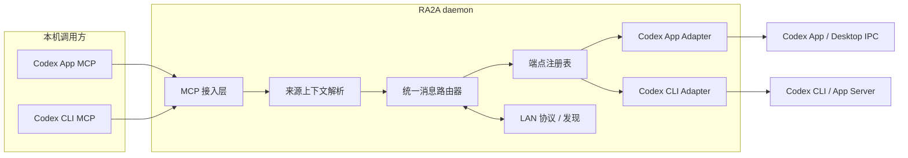

# RA2A v0.0.15 工程实施计划

- 状态：executing（Phase 1-3 主体已落地并测试通过；Phase 4-6 与 CLI→App 方向待办）
- 计划日期：2026-09-02
- 最近修订：2026-09-28（依据 Codex CLI `0.158.0` 的 V10 实测重定向投递入口、wrapper 定位与所有权结论；同日落地 Phase 1-3 主体与归属登记）
- Product Authority Source：[prd.md](./prd.md)
- Applicable Decisions：PD25、PD26、PD27、PD28、PD29、PD30、PD31、PD32

## 0. 发布状态与范围偏差（需 Owner 确认）

`v0.0.15` 已于 2026-09-13 发布（tag `v0.0.15`，GitHub Release 为 Latest），但**发布范围小于本计划范围**：实际交付为 Desktop 26.908 协议兼容修复、可选 codex wrapper 安装器、CLI 探针工具；Codex CLI 适配器与四方向交叉矩阵未交付，README 支持列表仍为"计划支持"。

本计划其余部分（Phase 0 收尾 + Phase 1-6）继续有效，但需要 Owner 明确承载版本：

| 选项 | 说明 |
| --- | --- |
| A：另立版本承载 CLI 适配器 | 本计划改为新版本号计划，`v0.0.15.md` 保留缩减范围说明 |
| B：重开 v0.0.15 范围 | 承认发布内容与 PRD 不一致，需要补齐 CLI 能力与 README 更新 |

在 Owner 决定前，本文件继续以 `v0.0.15` 为工作文档，不擅自改版本号。

## 1. 目标

在保持现有 Codex App 能力的前提下，引入 Codex CLI，并建立"统一端点 + 统一消息 + Agent 适配器"的内部架构。路由复杂度应随 Agent 类型数量线性增长，而不是形成 N×N 的成对集成。

## 2. 当前实现基线

当前代码已经存在部分可复用边界，但数据模型和运行时仍是单宿主：

- `cmd/ra2a/main.go` 中存在 `sessionSource` 接口，但 daemon 只启动一个 Codex session source，并在其中混合 App Server 与 Desktop IPC 路由。
- `internal/operator/operator.go` 只有单一 `Codex` 可执行文件配置。
- `internal/lannode/node.go` 的 `Session` 没有 Agent 类型、能力和适配器身份。
- `internal/control/control.go` 默认目标地址为 `ra2a://node/session`，来源也只携带 session ID。
- `internal/mcpserver/server.go` 的工具描述和调用上下文均绑定 Codex session，并依赖 `_meta.threadId`。
- `internal/codexhost/host.go` 直接管理 Codex App Server。

v0.0.10-v0.0.14 的 Desktop 开发已把 `internal/codexhost` 打磨为三平台 native 验证过的共享托管基座：单 owner、每次启动独立 socket、PID/socket owner lease、daemon 首次探测与主动监督恢复已退出的受管 App Server、Linux 进程组收割与崩溃安全清理时序、stop/exit 明确控制生命周期。CLI 路线（单 App Server + remote TUI）直接消费该基座，Phase 3 不重复设计或验证 managed host 生命周期。

**2026-09-28 新增事实（V10）**：Codex CLI `0.158.0` 已自带官方 app-server daemon（`codex app-server daemon {start,restart,stop,version,...}`，机器可读 JSON），并把 daemon 自挂接提升为默认开启的稳定特性（`Feature::DaemonAutoStart`，`Stage::Stable` + `default_enabled: true`）。普通 `codex` 零动作即挂接共享 daemon，RA2A 可作为第二个 app-server 客户端接入同一 socket。这带来一个必须由 Owner 决定的架构问题：**`internal/codexhost` 自管 App Server 与官方 daemon 争夺同一角色**。本计划暂按"RA2A 消费官方 daemon、不再自管 CLI 侧 App Server"推进，`codexhost` 保留给 RA2A 内部与 Desktop 路径；该选择的最终形态见 §12 待决项。

结论：不能把 Codex CLI 作为现有 source 内的额外条件分支。应先把已有 Codex App 行为收口为适配器，再增加 CLI 适配器。

### 2.1 信箱：测试期临时手段，不是正式路径（2026-09-29 更正）

**正式路径是 session 直投**：任意已适配 harness 之间互相投递，与 codex↔codex
同构，地址来自 `list_targets`，投递语义是「在目标会话里产生一个 turn」。

信箱是在实现过程中为解决一个**临时**问题而引入的：开发期需要一个零成本、
不依赖任何 harness 适配的通道，用来传递部署与联调指令。它不是产品能力，
不进入互通矩阵，也不应被当作 agent 间通信的常规手段。

因此：
- 任何 agent 之间的通信都走 session 直投，包括协调类消息。
- 信箱仅用于「收方没有适配任何 harness、无法接收 turn」这一种情形。
- 不得以信箱投递成功来主张任何互通结论。

## 3. 目标架构


```mermaid
flowchart LR
    subgraph Callers[本机调用方]
        APP[Codex App MCP]
        CLI[Codex CLI MCP]
    end

    subgraph RA2A[RA2A daemon]
        MCP[MCP 接入层]
        CTX[来源上下文解析]
        ROUTER[统一消息路由器]
        REG[端点注册表]
        PROTO[LAN 协议 / 发现]
        AA[Codex App Adapter]
        CA[Codex CLI Adapter]
    end

    APP --> MCP
    CLI --> MCP
    MCP --> CTX --> ROUTER
    ROUTER <--> PROTO
    ROUTER --> REG
    REG --> AA
    REG --> CA
    AA --> APPHOST[Codex App / Desktop IPC]
    CA --> CLIHOST[Codex CLI / App Server]
```

核心规则：

1. MCP 与 LAN 层只处理统一端点和统一消息，不调用宿主原生 API。
2. 每种 Agent 实现一个适配器；适配器之间不互相引用。
3. 注册表汇总多个适配器的端点，并维护端点到适配器的确定性映射。
4. 路由器只负责本地/远端路由、超时和统一结果，不解释宿主错误。
5. 宿主所有权、writer、UI/TUI 同步和恢复逻辑封装在对应适配器内。
6. 适配器所有权必须由已验证的接入边界显式建立；不得根据 App Server 的 `thread.source` 猜测 Codex App/CLI 类型。

## 4. 建议内部契约

以下为工程候选契约，不属于已确认产品决策；在 D0 实验后收敛字段。

### 4.1 AgentAdapter

```go
type AgentAdapter interface {
    Descriptor() AdapterDescriptor
    ListEndpoints(context.Context) ([]Endpoint, error)
    Deliver(context.Context, EndpointRef, MessageEnvelope) DeliveryResult
    ResolveCaller(context.Context, CallerContext) (EndpointRef, error)
    Health(context.Context) AdapterHealth
    Close() error
}
```

接口只表达当前两类 Codex 宿主共同需要的能力。实验未证明需要的生命周期钩子不得提前加入。

### 4.2 统一端点

候选字段：

- `endpointID`：节点内唯一标识
- `agentType`：如 `codex-app`、`codex-cli`
- `nativeSessionID`：仅适配器解释
- `ownerRef`：适配器内部登记的接入所有权，不对 LAN 或 MCP 暴露
- `title`、`status`
- `capabilities`：例如 `receiveText`、`replyAddress`、`interactiveSafe`
- `address`：由 daemon 生成的完整、不透明目标地址

LAN 和 MCP 对外只暴露完成任务所需字段，不暴露 socket、pipe 或 App Server 地址。

### 4.3 统一消息信封

v0.0.15 保持文本消息，候选字段：

- 消息 ID
- 协议版本
- 来源端点地址
- 目标端点地址
- 文本正文
- 创建时间与可选诊断上下文

信封不得包含 Codex App/CLI 专用命令。

### 4.4 统一投递结果

至少区分：

- `delivered`：宿主明确接受消息，并新建 turn 或追加到现有 turn
- `busy`：目标存在但当前不能写入
- `not_found`：端点不存在
- `unreachable`：节点或适配器不可达
- `unsupported`：目标存在但不具备所需能力
- `start_required`：所需本地 Agent 接入服务未运行，调用 Agent 应提示用户确认是否拉起
- `unknown`：请求可能到达，无法确定是否创建 turn

适配器保留原始诊断信息，但不得把宿主异常直接变成跨 Agent 协议。

## 5. 预投资验证

产品决策已经确认。以下实验未通过前，不进入大规模重构；实验负责选择满足 PD29、PD31 的最小技术路线，不得降低产品准入标准。

| ID | 要验证的问题 | 方法 | 通过条件 | 失败后的处理 |
| --- | --- | --- | --- | --- |
| V1 | Codex CLI 调用 MCP 时是否提供稳定 session/thread 身份 | 使用现有 MCP context probe 记录真实调用元数据 | 能稳定映射到当前 CLI session | 若不能稳定识别，则按 PD31 暂不支持 CLI 作为发送端，不伪造来源 |
| V2 | `codex exec resume <id> <prompt>` 能否向空闲 CLI session 精确创建一次 turn | macOS/Linux/Windows 分别执行并核对历史 | 无重复、结果可判定、session 可继续恢复 | 排除 direct-resume 路线 |
| V3 | 外部 resume 对活跃 TUI 的 writer 和刷新有何影响 | TUI 活跃时注入，多轮观察状态和继续输入 | 不抢占 writer、不永久 thinking、TUI 可继续交互 | direct-resume 不作为正式支持路径 |
| V4 | RA2A App Server + `codex --remote` 是否能共享所有权 | 由 RA2A 启动 App Server，TUI remote 接入，多轮交叉投递 | 单一所有者、消息实时显示、人工输入正常 | 重新评估 CLI 支持边界 |
| V5 | App Server 版本变化能否被探测和隔离 | 对当前与最低支持 Codex CLI 做契约测试 | 不兼容时明确报错，不污染路由层 | 增加适配器版本门槛 |
| V6 | 同一节点 App 与 CLI 端点能否无冲突汇总 | 在独立 `CODEX_HOME` 下，通过登记式接入边界（连接级 `clientInfo` 关联 start/resume/turn）同时发现两类宿主，记录主/辅助 thread 的稳定区分规则 | 地址唯一、类型正确、投递到唯一目标；未知归属不展示为 ready；CLI 断开、重连与 resume 后登记关系不迁移 | 调整端点身份模型并复验；禁止用 `thread.source` 猜测类型；所有权路线未稳定前不进入 Phase 1 |
| V7 | 单 App Server + remote TUI 能否安全接收 active-turn follow-up | 首条消息触发长时间 turn，在执行期间注入第二条消息并继续人工输入 | follow-up 在同一 thread 中精确执行一次、无重复、TUI 实时更新、人工输入正常 | 不进入 CLI 适配器实现，重新评估活跃 turn 投递入口 |
| V8 | CLI 写入路径是否存在隐藏前置条件（等效 Desktop `text_elements` 缺失与空 model 竞态教训） | **已重定向为 V8-R**：目标从 `thread/queue/*` 改为 `thread/resume` + `turn/start` / `turn/steer`。V10 已固定 UUID 格式、同步错误形态、`canAcceptDirectInput` 门禁、`turn/completed` 唯一确认口径；剩余真实 TUI 投递与 renderer 敏感项待独立认证后执行 | 确认投递前置条件集与失败形态并固定进契约测试；不得出现"先回 turn ID 再异步失败"的不可判定结果 | 回到计划评审调整投递入口，不得静默降级到 direct resume |
| V9 | 「用户正常启动 codex 零动作接入」能否靠官方 daemon 自动挂接 | 安装 standalone codex 并启动官方 daemon，验证普通 `codex` 自动连上 daemon 且外部客户端可用 | TUI 自动挂接 daemon，RA2A 作为其客户端投递 | 已在 `0.158.0` 被 V10 取代：实测通过，wrapper 降级为兜底。`0.153.4` 的失败结论仅对该版本有效 |
| V10 | `0.158.0` 上官方 daemon 自挂接、第三方接入方式与投递契约是否成立 | 隔离 `CODEX_HOME` 下真实启动 daemon 与 TUI，以 socket inode 比对 + `ss -xap` 验证挂接；WebSocket over AF_UNIX 客户端实测 `thread/*`、`turn/*` 契约、originator 全局污染、多订阅者 fan-out | 零动作挂接成立；同 uid 第二客户端可投递；投递确认口径唯一；所有权判别字段可用或明确不可用 | **已通过**（见 `experiments/codex-cli-v10.md`）。所有权字段实测不可用，改为 RA2A 侧自建登记 |
| V11 | RA2A 作为官方 daemon 第二客户端的端到端投递（真实 TUI thread、活跃回合 follow-up、人工继续、20+ 轮） | 隔离环境完成独立认证后，按 V8-R 方法执行 | 四方向各通过，含 TUI 实时显示与人工继续 | 回到计划评审；PD31 准入未达成则不发布 CLI 支持 |

实验输出写入 `docs/v0.0.15/experiments/`，记录命令、版本、平台、观察结果和结论。只有结论进入架构，原始日志不提交敏感信息。

所有实验先通过 PD32 隔离门禁：使用独立的开发配置、运行目录、日志、控制地址、App Server socket、节点身份和测试会话；不得执行会安装、升级、停止、重启或重新配置本机正式版的命令。启动前检查与正式版的资源冲突，无法确认隔离时立即停止。

当前进度：V1-V4 与 V7 已完成 macOS 首轮验证；V7 证明 CLI active turn 接收 follow-up 时采用同 thread 排队并在当前 turn 后执行的语义。V5 已完成 `0.151.0`/`0.152.1` 双版本 macOS 契约对比，两版均可从 `initialize.userAgent` 探测版本。V6 macOS 首轮未通过：App Server 创建的测试 thread 与 remote TUI thread 都返回 `source: vscode`，V10 在 `0.158.0` 上复现同一结论，且进一步证明 `originator` 是 daemon 进程级全局值、first-writer-wins，同样不可用作判别。V6-R1 已证明透明接入代理可以用 `clientInfo=codex-tui` 关联 start/resume/turn 的原生 thread ID。

2026-09-28 依据 V10（`0.158.0`，Ubuntu native，隔离 `CODEX_HOME`）重排 Phase 0 结论：

- **零动作路线成立，wrapper 降级**：`DaemonAutoStart` 已是默认开启的稳定特性。实测 daemon 不存在时普通 `codex` 约 5 秒内自行拉起 daemon 并建 socket，daemon 已存在时直接接入，socket inode 与 `ss -xap` 双向比对确认 TUI 与 daemon 之间 ESTABLISHED。V9 在 `0.153.4` 上的失败结论仅对该版本有效。`cmd/codex-wrapper` 保留为排除场景兜底（`--no-daemon`、`--oss`、`-c`/`--enable`/`--disable`/`--search`、`--profile`、自定义 config loader、`--strict-config`、`--dangerously-bypass-hook-trust`、workload identity、`CODEX_EXEC_SERVER_URL`、Bedrock 向导、Windows 非提升终端），不再是主路径。
- **投递入口改为 stable 路径**：`thread/queue/*` 全部 experimental 且要求 thread 已 loaded，退出主路径；投递固定为 `thread/resume` 建立订阅 + `turn/start`（空闲）/ `turn/steer`（活跃，带 `expectedTurnId`）。`turn/start` 不受 `experimentalApi` 门禁。
- **投递确认口径唯一**：`turn/start` 先返回 turn ID 且 `error: null`，失败在 5 次 `Reconnecting... N/5` 后由 `turn/completed`（`status: failed`）暴露。适配器必须以 `turn/completed` 为唯一成功判据，`DELIVERY_UNKNOWN` 不重试、不切路径。
- **所有权仍需 RA2A 侧自建登记**：`Thread.source` 恒为 `vscode`；`Thread.originator` 为进程级全局值。服务端 `thread → connection` 映射为 `pub(crate)`，未映射到任何协议方法。未知归属 thread 不得发布为 ready。
- **PD32 隔离成本下降**：`CODEX_HOME` 决定 daemon socket，独立 `CODEX_HOME` 即等于隔离 daemon、socket、session 存储三件事，不再需要 `-c ephemeral=true`（V6 已证明其无效）。
- **剩余硬前置**：隔离环境的独立认证需用户参与；未认证时 `account/rateLimits/read` 返回 `codex account authentication required`，无法按 `runbooks/codex-account-usage-check.md` 核对 plan 桶用量，因此真实投递实验前必须先完成独立登录与用量门禁。

Phase 0 冻结条件更新：V10 已通过；V8-R 剩余项（真实后端回合质量、plan 弹条行为）与 V11（CLI 作为发送端、三平台复现）可继续推进。**关键结论：配置本地 mock 模型端点后，PD31 准入验证不再被登录阻塞**——TUI 完整回合、向 TUI thread 注入并实时渲染、活跃回合 `turn/steer` follow-up 均已在无账号条件下真机通过。剩余阻塞只有三平台复现与真实后端行为。`0.158.0` 是当前唯一验证过的版本，`0.151.0` 在完成真实投递前只作为契约最低候选。

2026-09-06 依据 Codex Desktop 开发沉淀（v0.0.10-v0.0.14）重审本计划：

- **托管基座已前置完成**：managed Codex App Server 生命周期（单 owner、独立 socket、owner lease、首次探测恢复、主动监督重启、Linux 进程组收割、崩溃安全清理、stop/exit 语义）已在 macOS/Linux/Windows 三平台 native 验证，成为 CLI 路线复用基座。Phase 3 只实现 CLI 消费方，不再设计与验证该生命周期。
- **写入前置条件仍空白**：Desktop 经验证明宿主写入存在隐藏前置（`text_elements` 缺失导致 renderer error boundary；空 model 让 Desktop 先回 turn ID 再异步失败，须启动前解析 thread/rollout 原始模型）。V5 只 pin 了 schema 参数/必填，未排查此类前置；新增 V8 在独立环境探索 `thread/queue/*` 与 `thread/resume` 的等价风险。
- **所有权沿用登记式接入边界**：V6-R1 的「连接级 `clientInfo` 关联」升级为 Phase 3 架构硬约束；跨连接扫描 `thread.source` 不可靠这一结论，被 Desktop 的 per-process owner/writer 经验再次印证。
- **PD32 独立环境不再是硬前置**：独立 `CODEX_HOME` 与独立认证需用户参与完成；`ephemeral` 覆盖不能替代。V6/V7/V8 与三平台验证都在独立环境真机执行。
- **TUI 真机验证不可替代**：后台 write/read、rollout 或 schema 契约均不能证明投递成功；三平台验证聚焦 TUI 实时显示与人工继续交互。

2026-09-06 追加（路线决策，V9 记录见 `experiments/codex-cli-v9.md`）：

- **V9 daemon 自动挂接未生效**：standalone codex 0.153.4 + 官方 daemon 在本机实测，普通 `codex` TUI 未自动连到 daemon（源码含 `maybe_probe_default_daemon_socket` 机制但发布版未触发）；且 `thread-follower-*` 仅存在于 Desktop 私有侧，开源 CLI 无等价的「正常运行即暴露注入通道」。
- **Owner 确认采用「包装器代传 `--remote`」路线**：`cmd/codex-wrapper` 在 RA2A 托管 app-server 可用（owner lease + socket 可连）时向用户普通 TUI 启动注入 `--remote unix://<managed socket>`；RA2A 不可用、已卸载或用户显式指定 `--remote` 时完整透传原生 codex，不影响原生体验。server 始终是官方 `codex app-server` 二进制，RA2A 保持纯客户端。
- **原型已端到端验证**（commit `6774ad1`）：注入 / 无 lease 降级透传 / 显式 `--remote` 透传三种行为均通过；单测覆盖参数分类、lease 门禁、socket 活性判定与自引用防护。queue 投递链（`1a5d83e`）真机验证：活跃回合入队 → TUI 实时显示 → 下回合精确执行。安装器集成（`d7fac02`）：`install.sh --codex-wrapper` / `install.ps1 -CodexWrapper` 安装包装器与 marker，卸载自动还原原生 codex，拒绝覆盖非 RA2A 管理的 `codex`；未在正式机执行。Phase 4 剩余 MCP 来源识别/config 迁移仍待办。

## 6. 实施阶段

### Phase 0：产品决策与可行性冻结

依赖：通过 PD32 隔离门禁并完成 V1-V8（V9 已被 V10 取代，V8 已重定向为 V8-R）。

工作：

- 以 PD29-PD31 作为启动行为、地址兼容和 Agent 支持门槛。
- 路线已定（V10）：CLI 侧消费官方 `codex app-server daemon`，RA2A 作为同 uid 第二客户端接入其控制 socket；不再自管 CLI 侧 App Server。需 Owner 确认 `internal/codexhost` 的最终边界（§12）。
- 所有权：登记式接入边界仍为 Phase 3 硬约束。V10 已排除 `source` 与 `originator` 两条协议判别路径，因此登记表必须由 RA2A 侧记录本连接 create/resume 的 thread ID 来建立；未知归属端点不得标记为 ready。
- 用独立 `CODEX_HOME`（连带隔离 daemon、socket、session 存储）与独立认证通过 PD32 门禁；独立认证需用户参与完成。
- 完成 V8-R 剩余项：真实后端回合质量、plan 级 rate-limit 弹条行为；协议层与 TUI 层前置已由 V10 免登录验证关闭。
- 完成 V11：四方向端到端投递，含 TUI 实时显示、人工继续与 20+ 轮退化。协议与 TUI 行为可用 mock 端点免登录验证。
- 将实验结论映射到适配器最小接口。

完成标准：技术路线满足受保护产品决策，并证明不会破坏活跃 TUI、人工继续交互和全交叉支持门槛。

### Phase 1：提取宿主无关核心

主要位置：

- 新增 `internal/agentbridge/`：统一类型、适配器接口、端点注册表。
- 调整 `cmd/ra2a/main.go`：加载多个适配器，不再持有单一 session source。
- 调整 `internal/control/`：通过注册表和路由器投递。
- 将当前 App Server/Desktop IPC 路径收口到 `internal/codexapp/` 适配器；迁移时尽量复用现有代码。

验证：

- 现有 Codex App 单元测试和双设备投递全部通过。
- 保持 v0.0.10 active-turn 语义：空闲消息只 start 一次，执行中的 follow-up 只 steer 一次且进入同一 turn；UI 实时更新、人工可继续，不确定结果不回退或重试。
- 使用内存假适配器证明注册、冲突检测、选择和错误映射。
- 路由层代码中不存在具体宿主类型判断。

回滚边界：此阶段不改变 LAN 协议和公开地址；可以按一个原子提交回退。

### Phase 2：端点协议与混合版本兼容

主要位置：

- `internal/lannode/`：session 表达升级为带 Agent 类型和能力的 endpoint。
- `internal/control/`：解析完整目标地址并选择适配器。
- `internal/mcpserver/`：`list_targets` 返回 Agent 类型、能力和完整地址，工具文案改为 Agent 中立。

要求：

- 明确协议版本和能力字段。
- v0.0.14 节点与 v0.0.15 节点混用时，不得误投或崩溃。
- 若地址格式变化，提供已确认的兼容读取期；写出统一新格式。

验证：协议编解码、旧新节点矩阵、未知 Agent 类型和未知能力测试。

### Phase 3：Codex CLI 适配器

主要位置：新增 `internal/codexcli/`，实现路径由 V10 结论确定。

职责：

- **接入官方 daemon**：用 `codex app-server daemon version` 判定 `start_required` 与可用状态（该命令在 daemon 不存在时失败并返回连接错误，不返回 JSON）；daemon 可用时以 WebSocket over AF_UNIX 连接 `$CODEX_HOME/app-server-control/app-server-control.sock`，作为普通 app-server 客户端。传输层可用已有的 `gorilla/websocket` + `NetDial` 挂 UDS；`codex app-server proxy` 不能替代（它是纯字节中继，要求调用方自己说 WebSocket）。
- **不得自行拉起 daemon**：PD29 要求未运行时返回 `start_required` 并由调用 Agent 提示用户，不静默自动启动。
- **探测版本与能力**：从 `initialize.userAgent` 解析实际 app-server 版本并与 `daemon version` 的 `appServerVersion` 交叉校验；显式协商 `experimentalApi` 以使用 `canAcceptDirectInput` 门禁。注意 `initialize` 不返回协议版本号，版本门槛只能靠 daemon JSON 或实测探测。
- **建立 thread 所有权登记**：记录本连接 create/resume 的 thread ID 作为归属证据；禁止用 `Thread.source`（实测恒为 `vscode`）或 `Thread.originator`（实测为 daemon 进程级全局值、first-writer-wins）推断类型。未知归属不得作为 ready 端点发布。
- **管理 originator 副作用**：非 `codex_app_server_daemon` / `codex-backend` 的 `clientInfo.name` 会成为 daemon 进程级默认 originator，影响之后所有连接创建的 thread。适配器必须固定连接命名与连接顺序，并把该副作用写入可观测性事件。
- **投递路径**：`thread/resume` 建立订阅 → 空闲用 `turn/start`、活跃用 `turn/steer`（必须带 `expectedTurnId`）。不使用 `thread/queue/*`（experimental 且要求 thread 已 loaded）。**必须等 `thread/resume` 响应后再发 `turn/start`**，否则调用方收不到任何回合通知，投递无法确认。
- **投递确认**：以 `turn/completed` 为唯一成功判据，检查 `turn.status` 与 `turn.error`。`turn/start` 响应只用于取得 turn ID。宿主内置 5 次重连，确认窗口为秒级，窗口内不重试、不切换投递路径。
- **写入前门禁**：thread 已 loaded（`thread/loaded/list`）、`canAcceptDirectInput` 为真、`threadId` 为合法 UUID、显式携带 `textElements: []`；前置不足时先拒绝不投递。
- **订阅纪律**：不用即 `thread/unsubscribe`（订阅会钉住 thread 内存，最后一个订阅者离开后 thread 会被卸载并广播 `notLoaded` + `thread/closed`）；不代答审批类服务端请求（会 fan-out 给所有订阅者）；忽略与本次投递无关的 `error` / `warning` 通知。
- **已知宿主约束**：注入的 turn 运行在 daemon 启动时的环境变量下，不是用户终端环境；Windows 需非提升终端且 `CODEX_HOME` 路径需满足 AF_UNIX 108 字节限制，否则静默回退到 embedded server。
- App Server 实验接口变化只影响该适配器和契约测试。

验证：单适配器测试、真实 CLI 冒烟测试、长时间多轮退化测试、TUI 实时显示与人工继续的真机验收。

### Phase 4：MCP 来源识别与安装生命周期

主要位置：

- `internal/mcpserver/`：通过适配器解析调用方身份，不再只读取 Codex App thread ID。
- `internal/operator/` 与安装脚本：检测并注册 Codex App、Codex CLI；保持幂等安装、重启和更新。
- 配置迁移：将单一 Codex 路径迁移为可扩展的适配器配置，同时兼容已有安装。
- `codex wrapper` 定位调整：安装器保留 `--codex-wrapper` 选项，但文档与提示必须说明它是**排除场景兜底**（官方 daemon 自挂接被 `--no-daemon` / `-c` / `--profile` / `CODEX_EXEC_SERVER_URL` / Bedrock 向导 / Windows 非提升终端等阻断时才需要），不再作为 CLI 接入的正式路径。

验证：全新安装、v0.0.x 升级、重复安装、卸载/重启，以及三平台路径差异。

### Phase 5：交叉矩阵与退化验证

至少覆盖：

| 发送端 | 接收端 | 基本投递 | active follow-up | 20+ 多轮 | 人工继续 | 断网恢复 | daemon 重启 |
| --- | --- | --- | --- | --- | --- | --- | --- |
| App | App | 必测 | 必测 | 必测 | 必测 | 必测 | 必测 |
| App | CLI | 必测 | 必测 | 必测 | 必测 | 必测 | 必测 |
| CLI | App | 必测 | 必测 | 必测 | 必测 | 必测 | 必测 |
| CLI | CLI | 必测 | 必测 | 必测 | 必测 | 必测 | 必测 |

此外覆盖同机多端点、双设备、三设备和不同 Codex CLI 版本。任何方向出现永久 thinking、writer 抢占、重复 turn 或假成功，均阻止发布。

### Phase 6：文档与发布

- README 支持列表将 Codex CLI 从计划支持改为当前支持。
- 补充 CLI 启动、发现、发送和故障排查说明。
- 记录实验接口兼容范围和最低 Codex CLI 版本。
- 按现有 GitHub Release 流程发布 v0.0.15，附迁移说明和已知限制。

## 7. 工作单元与提交边界

| 工作单元 | 可独立验收结果 | 建议原子提交 |
| --- | --- | --- |
| W0a | V1-V4 首轮所有权实验完成 | `docs(v0.0.15): validate Codex CLI ownership model` |
| W0b | V5-V8、三平台和正式版隔离验证完成，Phase 0 结论冻结 | `docs(v0.0.15): freeze Codex CLI feasibility` |
| W1 | Agent 核心契约与假适配器通过 | `refactor(core): introduce agent adapter boundary` |
| W2 | 现有 Codex App 行为迁入适配器且无回归 | `refactor(codex-app): isolate host integration` |
| W3 | 端点协议与混合版本测试通过 | `feat(protocol): add typed agent endpoints` |
| W4 | Codex CLI 适配器真实投递通过 | `feat(codex-cli): add session adapter` |
| W5 | 安装、MCP 来源识别和配置迁移通过 | `feat(setup): register Codex CLI integration` |
| W6 | 四方向长时间测试和发布文档完成 | `release: prepare v0.0.15` |

不得将架构重构、CLI 新能力和发布元数据压入同一提交。

## 8. 可观测性

只增加能定位兼容边界的结构化字段：

- `adapter_kind`
- `endpoint_id`（避免记录消息正文）
- `delivery_stage`
- `native_error_class`
- `protocol_version`
- `owner_mode`

宿主级事件沿用并复用 codexhost 已有输出：`managed_codex_host_exited`、`managed_codex_host_reaped`、`managed_codex_host_reap_failed`。CLI 适配器级事件按 V10 结论调整：

| 事件 | 触发条件 | 诊断价值 |
| --- | --- | --- |
| `cli_daemon_state` | `daemon version` 判定结果（running / 不可达） | 区分 `start_required` 与宿主故障 |
| `cli_capability_rejected` | `canAcceptDirectInput` 缺失或为假、thread 未 loaded、ID 非 UUID | 定位写入前门禁拒绝原因 |
| `cli_caller_bound` | 本连接 create/resume thread 成功登记归属 | 所有权登记审计 |
| `cli_ownership_unknown` | 发现未归属 thread 而跳过发布 | 解释端点缺失 |
| `cli_originator_side_effect` | 本连接 `clientInfo.name` 成为 daemon 进程级默认 originator | 跨客户端污染取证 |
| `cli_turn_accepted_unconfirmed` | `turn/start` 返回 turn ID 但确认窗口内未收到 `turn/completed` | 区分"已接受"与"已投递" |
| `cli_turn_failed` | `turn/completed` 带 `status: failed` 与 `error` | 宿主终态失败分类 |
| `cli_unsubscribed` | 主动 `thread/unsubscribe` | 防止 thread 内存被钉住 |

原 `cli_queue_added` 随投递入口改到 `turn/*` 而退役。

关键路径应能区分“LAN 未到达、远端路由失败、适配器拒绝、宿主结果未知”，避免统一表现为超时。特别地，`turn/start` 返回成功**不得**映射为 `delivered`，必须等 `turn/completed`。

## 9. Execution Contract

### 环境前提

- Go 与仓库现有版本要求一致。
- macOS、Linux、Windows 各至少一台真实设备用于宿主验证。
- 测试固定记录 Codex CLI 版本；App Server 为 Experimental，不能只使用 mock 验收。
- 本机正式版视为受保护的外部系统；开发实例使用独立配置、运行目录、日志、控制地址、socket、节点身份和测试会话。
- Codex 宿主实验使用工作区内独立 `CODEX_HOME`（连带隔离 daemon、socket、session 存储）和独立认证；不得以未验证的 `ephemeral` 配置覆盖作为 session 隔离手段。
- 隔离实验标准流程见 `runbooks/codex-cli-isolated-daemon-experiment.md`。
- 验证脚本必须在启动前检查资源归属和冲突，且只能清理本次开发实例创建的资源。
- 不创建新分支，遵守仓库原子提交和推送约束。

### 执行顺序

`Phase 0 → Phase 1 → Phase 2 → Phase 3 → Phase 4 → Phase 5 → Phase 6`

Phase 0 完成并冻结 V8-R / V10 / V11 结论前不进入 Phase 1 主体架构重构。Phase 3 依赖官方 daemon 路线与所有权登记路线验证通过。

### 停止条件

出现以下任一情况时停止扩张并回到 Owner：

- 官方可用入口无法在活跃 CLI 中避免 writer/UI 状态破坏。
- 无法在不静默启动的前提下为 `start_required` 提供明确恢复路径。
- 地址兼容方案要求调用方理解或拼接地址内部结构，违反 PD30。
- 为接入 CLI 需要在路由层加入 Agent 对特殊分支。
- 任一交叉方向无法达到 PD31 的准入门槛。
- 开发实例无法与本机正式版的配置、进程、端口、socket、网络身份或宿主会话可靠隔离。
- 单个手写生产代码阶段预计新增超过仓库约束，且没有更小方案。
- 官方 daemon 与 RA2A 自管 host 出现 owner 冲突且无法用明确规则消解。

### 完成定义

- PRD 状态变为 Ready，所有阻塞决策已确认。
- 四方向真实设备测试通过，包含多轮退化和恢复。
- 现有 Codex App 行为无回归。
- 适配器边界通过假第三适配器扩展测试。
- 安装、升级、重启和版本检查在三平台通过。
- 文档、版本号、Git 标签和 GitHub Release 一致。

## 10. Product Decision References

| 决策范围 | 权威决策 | 工程约束 |
| --- | --- | --- |
| Codex CLI 未运行 | PD29 | 返回 `start_required` 和可操作说明；不得静默自动拉起。V10 已提供官方判定手段（`daemon version` 失败即不可达） |
| 目标寻址 | PD30 | 地址由 `list_targets` 完整返回并视为不透明值 |
| Agent 支持准入 | PD31 | 所有已支持 Agent 之间的双向矩阵必须全部通过，否则不发布该适配器 |
| 开发环境隔离 | PD32 | 开发与实验不得变更、重启、停止或占用本机正式版资源；冲突时停止实验 |

## 11. Product Decision Delta

| 差异 | 原确认结论 | 实现/实验后的事实 | 需要 Owner 决定 |
| --- | --- | --- | --- |
| CLI 接入路径 | V9：官方 daemon 自动挂接不可用，采用 wrapper 代传 `--remote` | `0.158.0` 实测零动作自挂接成立，wrapper 降级为排除场景兜底 | 是否接受路线变更（不改变 PD29/PD30/PD31 的产品行为） |
| 投递确认语义 | 计划假定写入成功可由请求响应判定 | `turn/start` 响应不代表投递成功，终态只在 `turn/completed` | 是否确认 `delivered` 需等待终态（影响延迟指标与超时设定） |
| 端点所有权来源 | 计划假定可用连接级 `clientInfo` 关联建立所有权 | `originator` 为进程级全局值、`source` 恒为 `vscode`，协议层无所有权字段 | 是否接受"RA2A 侧自建登记表 + 未知归属不发布"作为最终口径 |
| host owner 归属 | 计划假定 RA2A 用 `internal/codexhost` 作为 CLI 侧共享 owner | 官方 daemon 提供同一角色且生命周期更完整 | `codexhost` 是否退位为 Desktop / RA2A 内部专用 |

## 11.5 已修复缺陷：opencode 忙闲投递的假失败

- 发现日期：2026-09-29
- 修复日期：2026-09-29
- 状态：**代码已修复并部署**；本机忙碌会话实测通过（0.14s），跨设备闭环因
  rog306 的 Codex Desktop 未运行而待对方恢复后确认。
- 证据：rog306 的 Codex 会话向 ubuntu407 的 opencode 会话投递时收到
  `DELIVERY_UNKNOWN`，而该消息确实存在于目标会话的用户消息序列中
  （`ses_f18969b8…` index 704/710，`role: user`，`completed: false`，排队态）。

### 真实根因：用错了端点

适配器用 `POST /session/{id}/message` 投递。该端点的 OpenAPI 契约是
**"Create and send a new message to a session, streaming the AI response."**，
响应体是 `AssistantMessage`。也就是说，它的语义是「发消息**并等 AI 答完，把答案
给我**」，耗时等于接收方整个 turn。

对活跃 agent 会话，一个 turn 是几分钟。任何承载投递结论的传输都不可能等这么久。
实测日志：

```
17:45:47.9  POST 开始
17:46:17.9  opencode_delivery_reconciled   ← 恰好 30s，callTimeout 到期
            post_error="context deadline exceeded"
```

opencode 提供了语义正确的端点：

```
POST /session/{id}/prompt_async
  "Create and send a new message to a session asynchronously,
   starting the session if needed and returning immediately."
  → 204 No Content
```

`204` 是宿主自己的受理确认，**这才是投递判据**。turn 是否跑完属于收信方，
与投递是否成立无关。

### 前一轮分析错在哪（须记账）

第一轮修复把确认改成「轮询会话历史看消息是否落库」，并把预算设为 25s。
该修复**逻辑上更正确，但全局更糟**：它让接收端耗时变成
`callTimeout(30s) + 轮询(25s) = 最多 55s`，而接收端 CoAP blockwise session
的上限恰好是 30s。**修复扩大了超时暴露面。**

当时的错误解释是「超时预算配比失衡」，据此推出的方案是「调参」或「投递/确认
异步解耦」。方向错了：不是预算没配好，是**在等一个不该等的东西**。换端点后
耗时从 30s+ 降到 0.14s，整条超时链自动消失，无需任何调参。

### 修复内容

- `PostMessage` 改走 `prompt_async`，只返回 error；204 即送达。
- `Deliver` 在 204 时立即判 `delivered`：不等历史、不等 idle、不读回合结果。
  回合失败不再能把已投递改判为失败。
- 仅当确认本身丢失（deadline 先于 204 到期）才查历史对账，此时才用
  `landedBudget`，默认由 25s 降为 8s —— 它是对账窗口，不是正常路径。
- 删除 `awaitTurnReply`：回合结果不再是投递判据。
- 测试假服务改为 `prompt_async` + 204；新增回归测试
  `TestDeliverReturnsWithoutWaitingForTheQueuedMessage`（宿主确认后即使队列
  消息 3s 后才进历史，投递也须在 1s 内返回）；并注册阻塞端点为 500，
  使回归立刻显式失败而非静默重现超时。

### 实测

| 场景 | 修复前 | 修复后 |
| --- | --- | --- |
| 本机 → 忙碌 opencode 会话 | 30s+ 后 `DELIVERY_UNKNOWN` | **0.14s `confirmed`** |
| 日志事件 | `opencode_turn_delivered` / `reconciled` | `opencode_delivery_accepted` |

### 教训（同类错误当晚出现三次）

1. `oc-wrapper` 写完提交但从未安装；
2. 二进制换了但 daemon 没重启；
3. 本轮：只验本机路径就宣布修复（本机路径无 CoAP 约束，跨设备路径有）。

三者根因相同：**用「代码写完 + 测试通过」或「我能测的路径」代替「实际会走的
路径 / 真正在跑的东西」。** 部署后必须核实运行进程的 `/proc/<pid>/exe`；
验证必须覆盖实际承载约束的那条路径。

### 仍未闭环

跨设备确认依赖对方节点恢复：rog306 的 Codex Desktop 当前未运行
（`DESKTOP_OWNER_UNAVAILABLE: no-client-found`），无法从本端唤起。
对方恢复并回消息后即可确认发送方拿到 `delivered`。

## 12. 待决项（阻塞 Phase 3）

| ID | 待决项 | 阻塞范围 | 建议 |
| --- | --- | --- | --- |
| D1 | CLI 侧 App Server owner 用官方 daemon 还是 `internal/codexhost` | Phase 3 全部 | 用官方 daemon（生命周期、升级、`start_required` 判定均已官方化）；`codexhost` 保留 Desktop 与 RA2A 内部路径 |
| D2 | RA2A 连接的 `clientInfo.name` 取值与连接顺序 | Phase 3 归属登记 | 固定名称 + 单连接长驻，避免污染 daemon 全局 originator；配合 `cli_originator_side_effect` 事件 |
| D3 | `delivered` 是否必须等待 `turn/completed` | Phase 3 投递结果映射与超时 | **按宿主分别判定**：Codex CLI 的 `turn/start` 异步且每条 turn 有终态，`turn/completed` 是权威判据；opencode 的 `prompt_async` 受理即回 204，**204 即判据，绝不等 turn**（见 §11.5：等待 turn 会使投递耗时等于收信方工作量，必然超时） |
| D4 | 承载版本号（见 §0） | Phase 6 发布 | 由 Owner 在选项 A / B 中选择 |

执行过程中若发现原确认决策不可实现，必须记录：受影响 PD、证据、用户影响、建议选项和 Owner 决定。不得把工程限制静默改写为产品行为。
